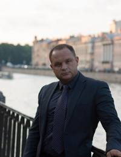

# Dementsov Alexey Alexandrovich



*****

### Contact Info

__Mobile:__ +7 911 711 11 67 
	
__E-mail:__ lexamet@mail.ru

__Vkontakte:__ vk.com/demlex

__GitHub:__ demlex

__Discord:__ demlex#7248

*****

### Objective 

__Go back at IT__

*****

### Skills

*Network Operating Systems:*   Windows NT-2019 Server; FreeBSD/Linux UNIX.  
*Networking:*   LAN&WAN& Secured WLAN design, installation and maintenance; network hardware; internetworking; TCP/IP; Internet & intranet.  
*Routers & Routing Systems:*   Cisco; Nortel; D-Link; HP; Juniper  
*Groupware & Communications:*   Microsoft Exchange 2000-2019 Server; Citrix  
*Development:*   MS Visual C++, C#; VBScript.  
*DBMS:*   TSQL; PL/SQL; Microsoft Access; mySQL.  
*Office Software:*   Microsoft Office (advanced programming skills).  
*FMA/ERP Software:* Scala; 1C; Monolit NT, Oracle E-Business Suite, SAP  
*Design system:*  ExoCad;  
*Web:* HTML; 1C-Bitrix; landing page development; php; CSS; Java-Script;  
*Non-Computer Skills:*   Principles of management, finances and business re-engineering, project management, analytical, critical thinking, and problem solving  

*****
## Example of Code


```C#
           using (var reader = new PdfReader(currentFile))
           {
                PdfReaderContentParser parser = new PdfReaderContentParser(reader);
                for (int i = 1; i <= reader.NumberOfPages; i++)
                {
                    var strategy = parser.ProcessContent(i, new LocationTextExtractionStrategyWithPosition());
                    var res1 = strategy.GetLocations();
                    var searchResult = res1.Where(p => p.Text.Contains(signaturedescription)).OrderBy(p => p.Y).Reverse().ToList();
                    for (int j = 0; j < searchResult.Count; j++)
                    {
                        XSignPosition = searchResult[j].X + (searchResult[j].XEnd - searchResult[j].X) * searchResult[j].Text.IndexOf(signaturedescription) / searchResult[j].Text.Length;
                        YSignPosition = searchResult[j].Y;
                        SigCtl sigCtl = new SigCtl();
                        DynamicCapture dc = new DynamicCaptureClass();
                        DynamicCaptureResult res = dc.Capture(sigCtl, name, reason + " стр " + i.ToString(), null, null);

                        if (res == DynamicCaptureResult.DynCaptOK)
                        {
                            SigObj sigObj = (SigObj)sigCtl.Signature;
                            String filename = System.IO.Path.GetTempFileName();
                            try
                            {
                                sigObj.RenderBitmap(filename, 400, 200, "image/png", 0.5f, 0xff0000, 0xffffff, 10.0f, 10.0f, RBFlags.RenderOutputFilename | RBFlags.RenderColor32BPP | RBFlags.RenderEncodeData | RBFlags.RenderBackgroundTransparent);
                            }
                            catch (Exception ex)
                            {
                                MessageBox.Show(ex.Message);
                            }

                            string newFile = InsertSignatureImageToPdf(filename, i);
                            loadPdf(newFile, false);

                        }
                    }

                }
                reader.Close();
            }
```

*****

### Experience


2007-2019  Toyota Motor Manufacturing Russia Saint Petersburg (Shushary)  
*Project Manager* 
- Implementing HR  module on 1C system. Project management
- Implementing accounting (taxes, accounts payable, fixed assets, budgeting, IFRS), logistic, production  and purchasing  on 1C system.  Project management.
- Infrastructure & Security development
- Support ERP Global System –  Oracle E-Business Suite


2001–2007	Vena Brewery & Baltika Brewery        Saint Petersburg  
*System Administrator  (2001 – 2003 Vena Brewery)*  
*IT specialist (2003-2004 Vena Brewery)*  
*Specialist of System Integration (2004-2006 Vena Brewery)*  
*Senior Specialist of System Integration (2006-2007 Baltika Brewery)*  

- Monolit NT (ERP class system) implementation; client-bank systems support; workflow analysis, design and implementation of working procedures; consulting services for Monolit NT users; system supervision, maintenance and trouble¬shooting; DBMS programming for Monolit NT. 
- Implemented up to production use set of Monolit NT modules (finance & commodity circulation modules).
- Designed and implemented extended enterprise network architecture, supporting several branch offices (St. Petersburg, Moscow, Ekaterinburg, Rostov-on-Don etc.), centralized management, disaster recovery system (over 40 servers & 350 workstations).
- Designed and implemented IT Infrastructure & Security
- Designed and implemented cash management system: several client-bank systems were integrated with Monolit NT system.
- Project management 
- Head of  System Administrators Group


1999–2001	OGGI	Saint Petersburg  
*System Administrator  (1999 – 2000)*  
*IT Manager (2000 – 2001)*  

*****
### Education

1994–1999	State University of Telecommunication named after professor M. A. Bonch-Bruevich (SUT) 
- Faculty of networks of communication (connection), systems of switching and computer facilities
- Diploma of a system engineer.

2002
- MSDBA Certificate
- MCSE Certificate

1999-2002 State University of Telecommunication named after professor M. A. Bonch-Bruevich (SUT)
- Post-graduate study

2005
- Certificate of Implementing Microsoft Internet Security and Acceleration Server 2004
- Certificate of Citrix Metaframe Presentation Server 3.0 Enterprise Edition Administration course
- Certificate of 1601-PMBS02 Project management in company. Standard ANSI PMBOK 3-rd Edition (2004) 

*****
## Languages

*English:* level B1.

*Russian:* native


